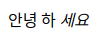
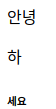
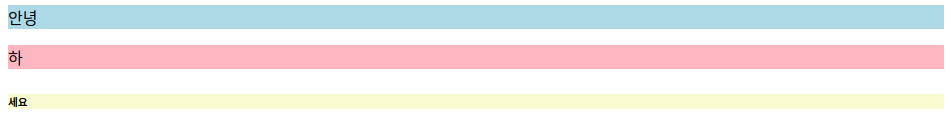

# display:

display 속성을 이용하면 요소들이 어떻게 보여지고 다른 요소와 어떻게 상호 배치되는지에 영향을 주는 display 유형을 설정할 수 있다. display의 값에는 여러 종류가 있지만 우선 가장 기본적인 세 개의 값에 대해 알아보겠다.

- inline
- block
- inline-block

<br />

## display: inline;

inline 요소는 줄바꿈 없이 다른 요소와 나란히 배치된다.

```html
<span>안녕</span>
<a>하</a>
<em>세요</em>
```

span, a, em 등은 모두 기본값이 inline인 태그이기 때문에 코드를 위와 같이 작성하면 웹페이지에서 아래와 같은 화면을 확인할 수 있다.(태그 별 기본 css요소 적용된 상태)

<br/>



<br/>

inline의 특징은 width와 height를 설정해도 적용되지 않는다는 것이다. inline 요소의 크기는 태그 안의 컨텐츠 크기에 맞춰 자동으로 설정되기 때문이다. margin과 padding도 좌우에만 적용이 가능하며 상하에는 적용되지 않는다.

<br/>

## display: block;

block 요소는 줄바꿈이 일어나며 자신이 차지할 수 있는 최대치의 가로 너비를 차지한다.

```html
<div>안녕</div>
<p>하</p>
<h6>세요</h6>
```

div, p, h1~h6은 기본값이 block인 대표적인 태그이다. 그러므로 위와 같은 코드를 작성하면 웹페이지에서 아래와 같은 화면을 확인할 수 있다. (태그 별 기본 css요소 적용된 상태)

<br/>



<br/>

내용을 감싼 태그만 변경했을 뿐인데 inline인 경우와는 큰 차이가 있다.

<br/>



<br/>

좀 더 확실한 차이를 보기 위해 각 요소에 배경색을 적용시켰다. 태그 안의 내용보다 훨씬 넓게 배경색이 적용되어 있다. 별도로 지정된 내용이 없기 때문에 화면상에 가득차게 한 줄을 전부 차지한다.

block은 width, height, margin, padding이 모두 적용된다.

<br/>

## display: inline-block;

inline-block은 이름 그대로 inline의 특성과 block의 특성을 모두 가지고 있다.

inline처럼 줄바꿈없이 한 줄에 다른 요소들과 함께 나란히 배치되지만, block처럼 width, height, margin, padding 속성 적용이 문제 없이 모두 가능하다. 만약 width와 height를 지정하지 않으면 inline처럼 태그 내부의 컨텐츠만큼의 영역이 자동으로 설정된다.

<br/>
<br/>
<br/>
<br/>
