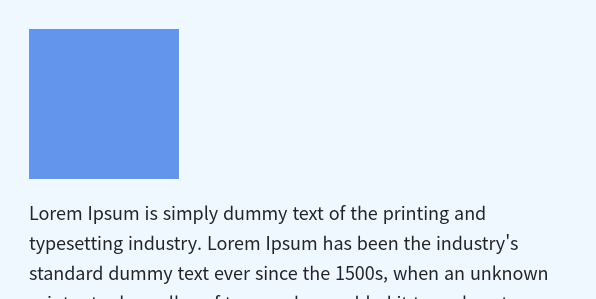
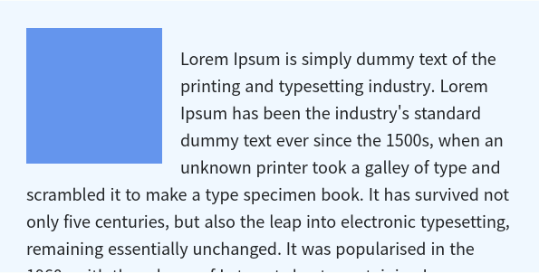
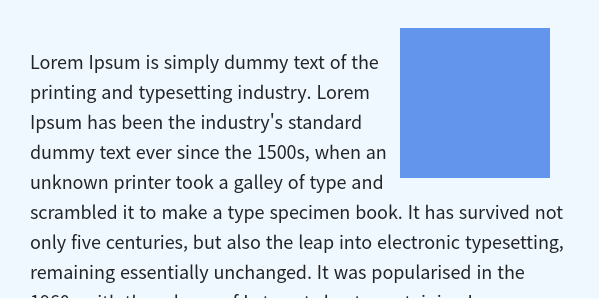
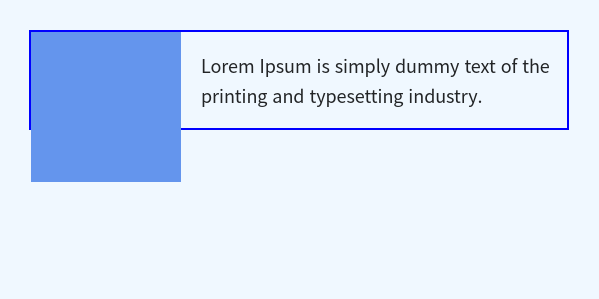

# float:

float은 요소가 일반적인 흐름으로부터 제외되게 만들어준다. 요소를 가로로 정렬하기 위해 사용하기도 하고, 텍스트나 인라인 요소가 특정 요소를 감싸게 만들기 위해 사용하기도 한다. 일반적으로 자주 사용되는 float의 값으로는 세 가지가 있다.

- none
- left
- right

 

## float: none;

none은 float의 초기값으로 float을 별도로 설정하지 않을 경우 모두 none이다.

 

## float: left;

left를 적용한 요소는 자신이 포함된 블록의 좌측으로 움직인다.

 

## float: right;

right를 적용한 요소는 자신이 포함된 블록의 우측으로 움직인다.

 

## float의 문제점

float을 적용했을 때, 부모 상자가 컨텐츠를 전부 감싸지 못해 아래와 같은 문제가 발생하는 경욱 빈번하다. 아래 예시는 float: left가 적용된 외부 상자가 내부에 있는 텍스트만큼만의 높이를 가져 내부 상자를 완전하게 감싸주지 못한다. 이럴 경우 아래에 이어지는 코드가 원하는 곳에 위치하지 못하게 된다.(파란선 상자 바로 아래부터 다음 컨텐츠가 위치하게 됨)

이런 현상을 해결하기 위한 방법(clearfix)으로 자주 쓰이는 것은 두 가지가 있다.

- clear 사용
- overflow 사용

### clear 사용

float을 적용한 요소의 부모 요소에 가상 요소인 after를 이용해 clear 속성을 적용시킬 수도 있고 별도로 clear 속성을 이용한 클래스를 만들어 놓았다가 필요한 경우 적용시키기도 한다.(일반적으로 클래스명은 clearfix 사용)

### overflow 사용

float을 적용한 요소의 부모 요소에 overflow 속성을 이용해도 위와 같은 현상을 해결할 수 있다. 하지만 overflow는 값에 따라 요소 밖의 컨텐츠가 숨겨지거나 요소에 스크롤이 생기기 때문에 사용 전 overflow를 적용해도 문제가 없는지 고려해야 한다.

 
 
