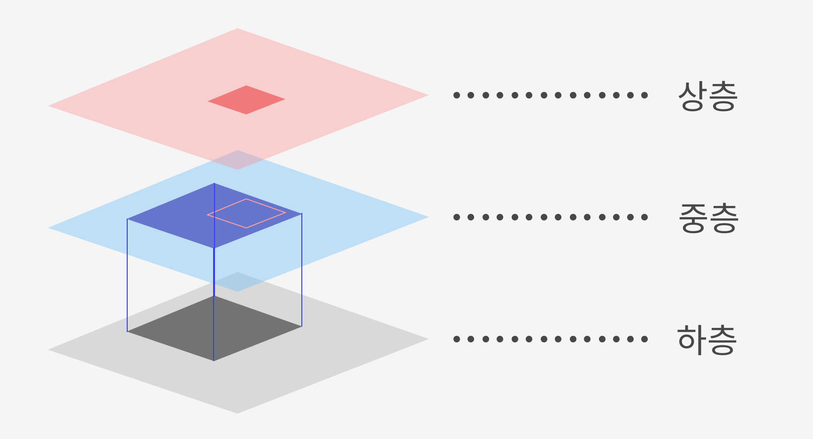
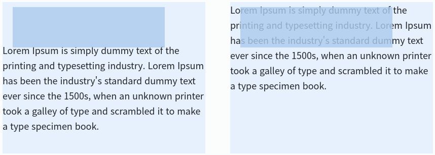

# position:

css에서 position 속성은 특정 요소를 원하는 위치에 위치시키기에 아주 편리하다. position의 값에는 다섯가지 종류가 있다.

- static
- relative
- fixed
- absolute
- sticky

## position: static;

static은 position의 기본값이기 때문에 position을 별도로 지정해주지 않는 경우 모두 static이다. top, left, right, bottom 속성이 아무런 영향을 주지 않는다.

 

## position: relative & absolute;

> ### MDN position - relative
>
> 요소를 일반적인 문서 흐름에 따라 배치하고, 자기 자신을 기준으로 top, right, bottom, left의 값에 따라 오프셋을 적용합니다. 오프셋은 다른 요소에는 영향을 주지 않습니다. 따라서 페이지 레이아웃에서 요소가 차지하는 공간은 static일 때와 같습니다.

> ### MDN position - absolute
>
> 요소를 일반적인 문서 흐름에서 제거하고, 페이지 레이아웃에 공간도 배정하지 않습니다. 대신 가장 가까운 위치 지정 조상 요소에 대해 상대적으로 배치합니다. 단, 조상 중 위치 지정 요소가 없다면 초기 컨테이닝 블록을 기준으로 삼습니다. 최종 위치는 top, right, bottom, left 값이 지정합니다.
> z-index의 값이 auto가 아니라면 새로운 쌓임 맥락을 생성합니다. 절대 위치 지정 요소의 바깥 여백은 서로 상쇄되지 않습니다.

 

위는 relative와 absolute 값에 대한 MDN의 설명이다. 하지만 위 설명만으로는 position에서 가장 빈번하게 사용되는 relative와 absolute에 대한 개념이 명확하지 못한 느낌이 들어 조금 다른 식으로 생각해보았다.

 

우선, 위의 그림처럼 position층이 총 3개로 이루어져 있다고 가정해보자. 하층의 회색 사각형은 static, 중층의 파란 사각형은 relative, 상층의 빨간 사각형은 파란 사각형을 기준으로 absolute를 적용했다고 가정한다.

relative를 적용한 파란 사각형은 자신의 값이 static이었을 때를 기준으로 자기의 자리를 남긴 채 한 층 띄워진다. 하층이 제일 기본이 되는 static층인데, relative는 자리를 그대로 차지한 채로 올라가기 때문에 하층에 남아있는 컨텐츠에서도 변화가 일어나지 않는다.

파란 사각형을 기준으로 absolute를 적용한 빨간 사각형은 중층에 자기의 자리를 남기지 않고 상층으로 띄워진다. 그러므로 아래에 있는 층의 컨텐츠에서 위치 변화가 일어난다. 즉, 같은 층에 존재하고 있지 않기 때문에 같은 위치가 겹쳐질 수 있다는 뜻이다.

좌측은 position: relative사용. 우측은 position: absolute사용.

 

## position: fixed;

fixed는 뷰포트를 기준으로 지정한 위치에 고정되어 있다. 뷰포트가 기준이 되기 때문에 스크롤 이동과는 무관하게 항상 같은 자리에 말 그대로 'fix'되어 있는 것이다.

웹페이지 내에서 흔하게 볼 수 있는 상단 이동 버튼이나 특정한 위치에서 고정된 네비게이션 바 등을 생각하면 이해가 쉽다.

 

## position: sticky;

sticky는 사용자의 스크롤 이동을 기준으로 하는 값이다. 사용자의 스크롤 위치에 따라 relative와 fixed 중 알맞은 것으로 변경되는 것을 사용하기 쉽게 묶어둔 것이 sticky라고 생각하면 이해가 쉽다.

중앙에 위치했던 특정 요소가 스크롤을 아래로 이동했을 때 상단으로 위치를 변경해 고정된 상태로 있는 웹페이지가 바로 sticky이다.

 
 
 
 
