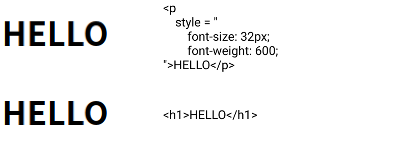

# semantic

프로그래밍을 공부하다 보면 semantic한 코드를 작성해야 한다는 내용의 글을 꽤나 자주 볼 수 있다. 그런데 'semantic한 코드'라는 게 대체 무엇일까?

semantic의 사전적인 뜻은 '의미의, 의미론적인'이다. 프로그래밍에서 사용하는 semantic의 뜻도 사전적인 의미와 같다. 코드 조각의 의미를 뜻한다.

다시 말해, 사람이 작성한 코드를 컴퓨터가 어떻게 이해하면 되는지에 관한 의미를 부여하는 것이다.

<br/>

## semantic Web

```html
<p style="font-size: 32px; font-weight: 600;">HELLO</p>
<h1>HELLO</h1>
```

위의 코드 두 줄은 화면상에서 똑같이 보인다. 아래의 이미지는 예시로 작성한 코드가 화면에 보이는 모습을 캡쳐한 것이다.

<br/>



<br/>

첫번째 HELLO는 p태그를 이용한 뒤 css 스타일을 넣어 글자의 크기와 두께를 키운 것이고, 두번째 HELLO는 h1태그를 이용해 스타일을 별도로 수정하지 않았다.

두 코드는 디자인적으로는 동일하지만, 의미적으로는 매우 다르다.

첫번째 HELLO는 하나의 문단을 나타내는 p태그를 사용했기 때문에 검색 엔진은 HELLO를 평범한 문단으로 인식한다. 그에 반해 두번째 HELLO는 제목을 나타내는 h1태그를 사용했기 때문에 검색 엔진은 HELLO라는 제목을 가진 페이지로 인식할 것이다.

이러한 과정은 브라우저와 검색 엔진 그리고 개발자 모두에게 웹페이지에 포함된 내용들의 의미를 명확하게 만들어준다. 의미가 명확한 코드는 사람에게도 컴퓨터에게도 가독성이 높아 태그를 무분별하게 사용한 페이지보다 훨씬 이해하기 쉽다.

<br/>

> ### MDN Semantics - 의미론적 마크업을 사용할 때의 이점
>
> - 검색 엔진은 의미론적 마크업 을 페이지의 검색 랭킹에 영향을 줄 수 있는 중요한 키워드로 간주합니다.
> - 시각 장애가 있는 사용자가 화면 판독기로 페이지를 탐색할 때 의미론적 마크업을 푯말로 사용할 수 있습니다.
> - 의미없고 클래스 이름이 붙여져있거나 그렇지 않은 끊임없는 div 들을 탐색하는 것보다, 의미있는 코드 블록을 찾는 것이 훨씬 쉽습니다.
> - 개발자에게 태그 안에 채워질 데이터 유형을 제안합니다.
> - 의미있는 이름짓기(Semantic naming)는 적절한 사용자 정의 요소 / 구성 요소의 이름짓기(namimg)를 반영합니다.

<br/>

## semantic Tag

html의 태그 중에는 태그의 이름만으로도 내부 컨텐츠의 의미를 전달하는 semantic 요소와 그렇지 않은 non-semantic 요소가 있다.

### non-semantic

div나 span과 같이 태그 자체가 가지고 있는 의미가 없는 태그

### semantic

h1~h6, header, nav, aside, section, article, footer, main, figure, details 등 태그 안의 컨텐츠가 어떤 의미인지 명확하게 설명하는 태그

<br/>
<br/>

## 읽어보면 좋을 포스트

- [Semantic code: What? Why? How?](https://boagworld.com/dev/semantic-code-what-why-how/)
- [시맨틱 요소와 검색 엔진](https://poiemaweb.com/html5-semantic-web)

<br/>
<br/>
<br/>
<br/>
